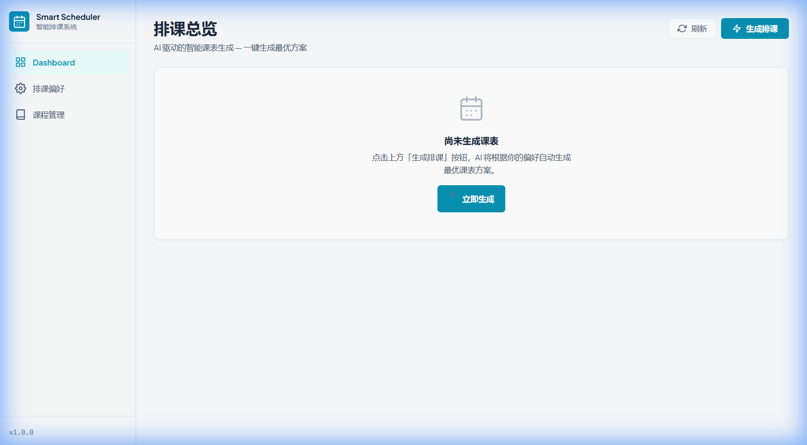
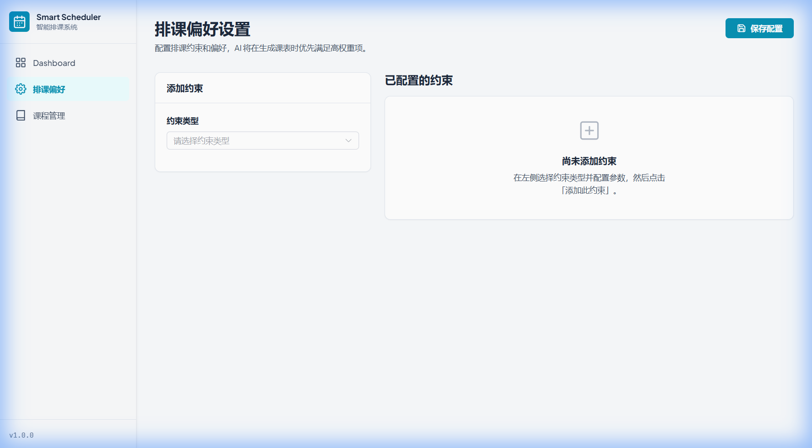
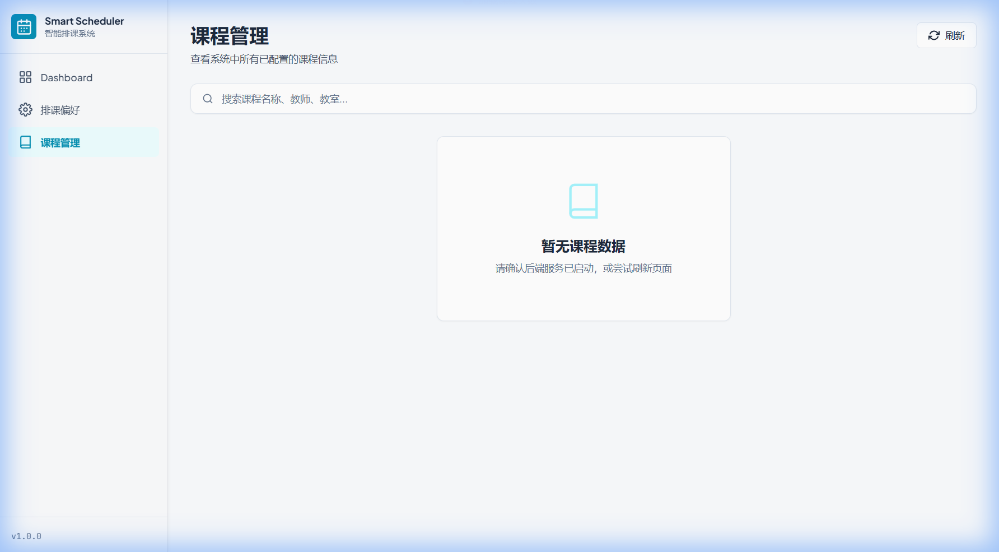
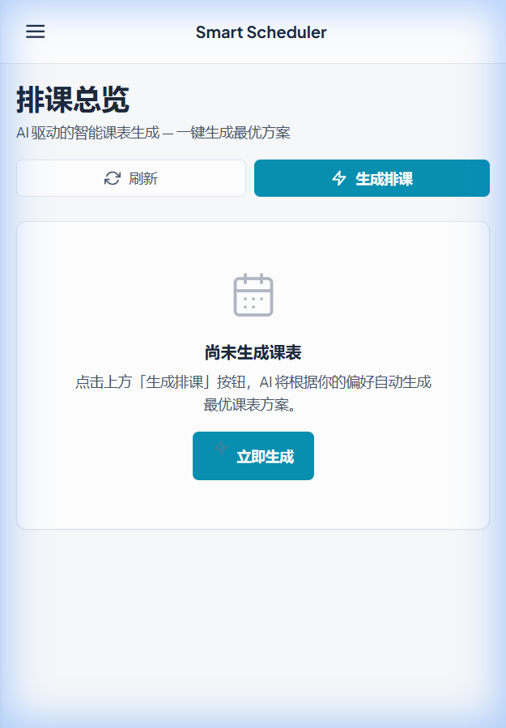

# Smart Course Scheduler

[](#)
[](#)

A **Timefold-powered smart course scheduling system** — takes a set of courses + user constraints, then generates a feasible timetable by optimizing **Hard/Soft constraints** via **Timefold Solver**.

---

## UI Preview (V2)

| Dashboard | Setup |
|:---------:|:-----:|
|  |  |

| Admin | Mobile |
|:-----:|:------:|
|  |  |

---

## Frontend V2 精修说明

本次 V2 前端精修聚焦 **可读性与布局质量**，范围仅限前端 CSS / Vue 组件，后端逻辑零改动。

### 本次范围

| 文件 | 改动 |
|------|------|
| `style.css` | 全新设计系统：5 级字号 (12/14/16/20/28px)、高对比文本、3 级阴影、移除玻璃效果 |
| `App.vue` | 侧边栏改为实色背景 (#F9FAFB)、240px 固定宽度、增大导航间距 |
| `DashboardView.vue` | 移除渐变 Hero、统计卡改为实色、空态居中 + CTA 按钮 |
| `SetupView.vue` | 表单卡实色化、两栏布局、约束空态带引导文案 |
| `AdminView.vue` | 搜索栏实色化、空态文案加深、表头中性背景 |
| `ScheduleGrid.vue` | 字号 ≥12px、移除 hover 缩放、tooltip 实色化 |
| `main.ts` | 补回 `import './style.css'`（此前漏引导致设计系统未生效） |

### 核心改动点

- **去玻璃化** — 全部 `glass-card` 替换为 `surface-card`（白色实背景 + border）
- **字号体系** — 12 / 14 / 16 / 20 / 28px（适配中文阅读）
- **对比度** — 主文本 `#1E293B`、次文本 `#475569`，均 ≥ 4.5:1
- **布局** — 侧边栏 240px，内容区最大 1200px，padding 32px
- **空态设计** — 每页都有 icon + 标题 + 描述文案 + 操作按钮

---

## Environment Requirements

| Dependency | Version  | Notes |
|------------|----------|-------|
| JDK        | 17+      | Required |
| Maven      | 3.8+     | Required |
| Node.js    | **≥ 20.19** 或 22.12+ | ⚠️ V2 前端需要 Node 20+ |
| PostgreSQL | 14+      | Only for production mode; H2 mode needs no DB |

---

## Quick Start — H2 Mode (Zero Install)

No database installation required. Use this for quick verification.

### 1) Start Backend (H2)
```bash
cd backend
mvn spring-boot:run -Dspring-boot.run.profiles=dev-h2
```
- Backend: `http://localhost:18081`
- H2 Console: `http://localhost:18081/h2-console`

### 2) Start Frontend
```bash
cd frontend
npm install   # first time only
npm run dev -- --port 15173 --host
```
- Frontend: `http://localhost:15173`

### 3) Build Frontend (Production)
```bash
cd frontend
npm run build        # TypeScript check + Vite production bundle
npx serve dist       # Preview production build
```

---

## Quick Start — PostgreSQL Mode (Production)

### 1) Prepare Database

Default config in `backend/src/main/resources/application.yml`:

| Item     | Default Value |
|----------|---------------|
| Host     | `localhost:5432` |
| Database | `smart_course_scheduler` |
| Username | `postgres` |
| Password | `password` |

```sql
CREATE DATABASE smart_course_scheduler;
```

### 2) Start Backend
```bash
cd backend
mvn spring-boot:run
```
- Backend: `http://localhost:8080`
- Flyway auto-creates tables + seed data on first start.

### 3) Start Frontend
```bash
cd frontend
npm install   # first time only
npm run dev -- --port 15173 --host
```

---

## Port Summary

| Service  | H2 (dev-h2) | PostgreSQL (default) |
|----------|-------------|---------------------|
| Backend  | 18081       | 8080                |
| Frontend | 15173       | 15173               |

---

## Database Mode

| Profile    | DB         | Config File |
|------------|------------|-------------|
| *(default)* | PostgreSQL | `application.yml` |
| `dev-h2`   | H2 (in-memory, MODE=PostgreSQL) | `application-dev-h2.yml` |

H2 mode uses `MODE=PostgreSQL` for SQL compatibility. Data resets on each restart.

---

## Test Account

This project is a **scheduling API** — it does not have user login/accounts.
- Seed data (25 courses + 5 constraints) is loaded via `V2__seed_data.sql`.
- Interact via REST API or Frontend UI directly.

---

## Core Features

- **End-to-end full stack**: Spring Boot 3 REST API + Vue 3 + Element Plus
- **Solver**: Timefold (Hard/Soft Score)
- **Database**: PostgreSQL + Flyway migrations (H2 for dev)
- **Asynchronous scheduling workflow**: Trigger (POST) → Poll (GET) → Fetch result (GET)
- **Constraint-driven**: V1.0 validates `NO_MORNING_CLASSES`, `NO_FRIDAY`, `PREFER_COMPACT_DAYS`, etc.
- **Smoke test**: Python script in `_team_sync/tests/`

---

## API Contract & Manual Verification

The single source of truth (SSOT) is under `_team_sync/`:

| Document | Path |
|----------|------|
| API Spec | `_team_sync/02_api_spec.md` |
| curl Examples | `_team_sync/06_curl_examples.md` |
| Python Smoke Test | `_team_sync/tests/test_scheduler_api.py` |

---

## Repository Layout

```
Smart-Course-Scheduler/
├── backend/          # Spring Boot + Timefold + Flyway
├── frontend/         # Vue 3 + Element Plus
├── _team_sync/       # SSOT docs (schema, API, constants, verification)
├── screenshots/
│   └── ui-v2/        # V2 UI screenshots (Dashboard, Setup, Admin, Mobile)
└── README.md
```

---

## Known Limitations

- **后端离线仅空态** — 前端可独立启动，但无后端时所有页面显示空态数据
- **Bundle 体积偏大** — JS bundle ~1076 kB (gzip ~354 kB)，Element Plus 全量引入导致；后续可按需引入优化
- **Vite config 代理** — `vite.config.ts` 中 `/api` 代理到后端地址，H2 模式下需确认端口匹配 (18081)

---

## FAQ

**Q: H2 mode 启动后数据是否持久化？**
A: 不会。H2 使用内存模式 (`mem:scheduler`)，每次重启数据会重置。Flyway + seed SQL 会自动重新加载。

**Q: 如何添加自定义约束？**
A: 在 `constraints` 表中 INSERT 新记录，`constraint_key` 需在 Solver 代码中有对应实现。详见 `_team_sync/03_constants.md`。

**Q: 前端代理如何配置？**
A: `frontend/vite.config.ts` 中 `/api` 代理到后端地址，H2 模式下需确认端口匹配 (18081)。

---

## Milestone Report

- V1.0 release snapshot: `_team_sync/07_milestone_v1.0.md`
